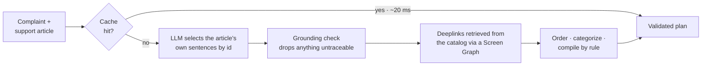

<p align="center">
  
</p>

# OneClick

**Vague complaint in, one-tap fix out.**

OneClick turns a customer's loosely worded Galaxy complaint and a Samsung support article into a
grounded, step-by-step troubleshooting plan, with verified Settings deeplinks that open the right screen
in one tap. Every step comes from the article; nothing is invented.

Samsung PRISM GenAI Hackathon 2026 · Theme 2: Smart Guided Troubleshooting · Team **Vibe Coders**

| | |
| --- | --- |
| 🎬 **Demo video** | [Watch on Google Drive](https://drive.google.com/file/d/1GvLDjTpm3jm9S1jTYc0IJ96J-gWKrlMP/view?usp=sharing) (under 5 minutes) |
| 📊 **Presentation** | [docs/SRM_VibeCoders_submission.pdf](docs/SRM_VibeCoders_submission.pdf) |
| 🏗️ **Architecture** | [docs/architecture.md](docs/architecture.md) |
| 📈 **Metrics** | [docs/metrics.md](docs/metrics.md) |
| 🤖 **AI disclosure** | [docs/LangAI3.0_AI_Disclosure - Vibe Coders.pdf](docs/LangAI3.0_AI_Disclosure%20-%20Vibe%20Coders.pdf) |

---

## Results

Measured on the final engine with free-tier models; full detail in [docs/metrics.md](docs/metrics.md).

| Measure | Target | Result |
| --- | --- | --- |
| Gates G2–G5 (health, coverage, schema, zero URLs) | all pass | **all pass** · 60/60 on our replica of the scorer |
| Schema-valid responses | ≥ 90% | **100%** |
| URL leaks | 0 | **0** |
| Step accuracy (LLM judge, 0–3) | – | **2.65** (kit 2.53 · unseen Battery / Camera / Performance 2.80) |
| Deeplink precision@1 (123 hand-labelled steps) | – | **90.8%** · relevance 1.84 / 2 |
| Repeat query, cache hit | p95 ≤ 300 ms | **17.6 ms** · 100% hits |
| Unseen paraphrase, cache hit | ≥ 80% hits | **94%** · p95 19.3 ms |
| Look-alike complaints wrongly served from cache | ≤ 2% | **0 of 60** |
| Cold query, full pipeline | p95 ≤ 8 s | **6.6 s** |
| Cost per query | tracked | **$0** on free tiers |

---

## How it works



- **The LLM chooses, code writes.** The model picks article sentences by id from a schema enum, so it
  cannot invent a step. Every graded field (goal, title, description, category, score) is built by rule.
- **Deeplinks are retrieved, never generated.** Hybrid keyword + embedding search over the catalog,
  grouped into Settings screens, picks the exact screen and the right on/off entry, and copies its URI
  unchanged.
- **Repeats and paraphrases come from cache** with no LLM call, guarded so a look-alike complaint
  ("screen is cracked" vs "screen is black") never gets the wrong plan.
- **It never fails.** Every request gets HTTP 200 and a schema-valid body; when something breaks
  inside, the answer degrades (another model, or the article's own instructions) and says why.

Full design, diagrams and decisions: [docs/architecture.md](docs/architecture.md).

---

## Quick start (Docker)

Needs [Docker](https://docs.docker.com/get-docker/) with Compose.

```bash
git clone https://github.com/VishaalPillay/OneClick.git
cd OneClick
cp .env.example .env          # optional: add free API keys (see below)
docker compose up --build
```

The first build takes a few minutes: it installs dependencies, bakes in the embedding model and builds
the search indexes. Then:

| Service | URL |
| --- | --- |
| API | <http://localhost:8000> |
| Site (walkthrough + live demo) | <http://localhost:3000> |

To run the API alone: `docker compose up --build api`. If port 3000 is taken:
`ONECLICK_CONSOLE_PORT=3100 docker compose up --build`.

Check that it is ready (it answers `503` while loading, then this):

```bash
curl http://localhost:8000/health
# {"status":"ok"}
```

### API keys: optional, free

| Key | Used for | Get one (free, no card) |
| --- | --- | --- |
| `MISTRAL_API_KEY` | Writing the plan (Ministral 14B and 8B) | [console.mistral.ai](https://console.mistral.ai) → API Keys |
| `GEMINI_API_KEY` | Query variations; backup model | [aistudio.google.com](https://aistudio.google.com/apikey) |

Put them in `.env`. **Without keys the engine still runs:** every answer is built from the article's own
instructions without a language model. Plans stay grounded and schema-valid but are less complete, and
`meta.reason` says `rules_only`. The best results need at least the Mistral key.

---

## Try it

Send a complaint with its support article. A ready-made request is in the repo:

```bash
curl -X POST http://localhost:8000/v1/troubleshoot \
  -H "Content-Type: application/json" \
  -d @data/fixtures/touch_lag/request.json
```

On Windows PowerShell:

```powershell
Invoke-RestMethod -Method Post -Uri http://localhost:8000/v1/troubleshoot `
  -ContentType "application/json" -InFile data/fixtures/touch_lag/request.json | ConvertTo-Json -Depth 12
```

The request body is `{"query": "...", "siis_response": {"title": "...", "content": "..."}}`; the article
may also be a plain string, or omitted. The answer (abridged):

```json
{
  "contexts": [
    {
      "goal": "Follow these steps to perform this Touchscreen Responsiveness Troubleshooting.",
      "title": "Touchscreen lag issues",
      "score": 0.86,
      "actions": [
        {
          "actionName": "Enable Touch Sensitivity",
          "description": "It will enhance touch responsiveness",
          "category": "auto",
          "stepGroups": [
            {
              "steps": ["Go to Settings.", "Tap Display.", "Tap the switch next to Touch sensitivity."],
              "actionableDeeplink": { "deeplink": "bixby://masked/act/14eb42b895", "message": "Enable Touch sensitivity", "…": "…" },
              "validationDeeplink": { "deeplink": "bixby://masked/val/6451858b28", "key": "Touch sensitivity", "…": "…" }
            }
          ]
        }
      ]
    }
  ],
  "meta": { "latency_ms": 5150.9, "cache_hit": false, "model": "ministral-14b-latest", "fallback": null, "…": "…" }
}
```

Send the same request again: the second answer comes from the cache in milliseconds. The live stage-by-
stage view is on the site at <http://localhost:3000>.

---

## Test it in the browser

The site walks through one real engine run, then hands over to **Try it live**, which sends your own
complaint to the running API and streams every stage as it happens.

**With Docker** it is already running: open <http://localhost:3000>.

**Without Docker**, run the API and the site in two terminals (needs Node 20+ for the site):

```bash
# terminal 1: the API (inside the Python environment from "Run without Docker" below)
cd api
uvicorn app.main:app --port 8000
```

```bash
# terminal 2: the site
cd console
npm install
npm run dev
```

Then:

1. Open <http://localhost:3000> and click **Try it live** at the top right (or scroll to section 08).
   The badge should read *Engine ready*. It shows *Engine waking up* while the API loads its indexes,
   and *Engine offline* if the API is not running.
2. The showcase complaint and its article are already filled in. Pick another case under **Or pick one
   of ours** (*Ask it again* for a cache hit, *Reworded* for a paraphrase, *Cracked screen* for a
   look-alike complaint that must not reuse the plan, *Two problems*, *No article*, *Wrong article*,
   *Prompt injection*), or write your own: a complaint in box 1 and the support article in box 2, as
   plain text or as `{"title": "...", "content": "..."}`.
3. Click **Find the fix**. The stages stream in live, then the plan appears with its steps and
   deeplinks. An empty answer shows why (for example, an article that does not match the complaint).
4. Click it again: the same request now comes back from the cache in milliseconds.

The page calls the API from your browser at `http://127.0.0.1:8000`. To point it somewhere else, set
`NEXT_PUBLIC_API_URL` before `npm run dev` (with Docker, `ONECLICK_PUBLIC_API_URL` before
`docker compose up --build`). Live runs use your LLM keys like any other request; without keys the
answers come from the rules-only path.

---

## Run without Docker

Needs **Python 3.11 or newer**.

```bash
python -m venv .venv
source .venv/bin/activate            # Windows: .venv\Scripts\activate
pip install -r requirements.txt
cd api
uvicorn app.main:app --port 8000
```

The first start downloads the embedding model (about 130 MB) and builds the indexes in memory; `/health`
turns `ok` when it is done. To use the site as well, see [Test it in the browser](#test-it-in-the-browser).

---

## API

| Method | Path | Purpose |
| --- | --- | --- |
| `POST` | `/v1/troubleshoot` | Complaint + article → plan. The scored endpoint |
| `POST` | `/v1/troubleshoot/stream` | Same engine, one Server-Sent Event per stage |
| `GET` | `/health` | `{"status":"ok"}` once loaded; `503` before |
| `GET` | `/v1/metrics` · `/v1/traces` · `/v1/trace/{id}` | Latency and cache counters; recent request traces |

No authentication. Responses follow the organisers' `ContextDeeplinkResponse` schema, plus a `meta`
block (latency, cache tier, model, cost, and a `reason` / `message` whenever a plan is empty or
unusual). The same values are sent as `X-Latency-Ms`, `X-Cache-Hit`, `X-Cache-Tier` and `X-Cost-Usd`
headers. Details: [architecture §8](docs/architecture.md#8-api-contract).

---

## Tests and reproducing the metrics

```bash
# unit and integration tests (no keys needed, no LLM quota spent)
cd api && pytest && cd ..
pytest eval/tests
python eval/sets/validate_sets.py
```

With the API running on port 8000 and keys in `.env` (the step-accuracy judge uses `GEMINI_API_KEY`):

```bash
cd api && python scripts/make_results.py --pause 8 && cd ..   # results.jsonl: 20 kit queries, each cold
python eval/gate_replica.py --api http://localhost:8000 --results results.jsonl   # gates G2–G5, blocks A1–A5
python eval/judge.py                                          # step accuracy on the kit plans
python eval/judge.py --api http://localhost:8000 --sets unseen --out eval/results/judge_unseen.json
python eval/loadtest.py --mode api --api http://localhost:8000   # latency, cache hit rates
python eval/report.py                                         # regenerates docs/metrics.md
```

Start the API on an empty cache before measuring (delete any `cache.sqlite` in the folder you start it
from), so first calls are genuinely cold.

---

## Submission

| Item | Where |
| --- | --- |
| Source code | This repository, tag `PRISM_GENAI_HACKATHON_Y2026` |
| Setup | This README, `requirements.txt`, `docker-compose.yml`, `api/Dockerfile` |
| Results file | [`results.jsonl`](results.jsonl): the 20 kit queries with 8–10 variations each |
| Demo video | [Google Drive](https://drive.google.com/file/d/1GvLDjTpm3jm9S1jTYc0IJ96J-gWKrlMP/view?usp=sharing) |
| Presentation | [docs/SRM_VibeCoders_submission.pdf](docs/SRM_VibeCoders_submission.pdf) |
| AI disclosure | [docs/LangAI3.0_AI_Disclosure - Vibe Coders.pdf](docs/LangAI3.0_AI_Disclosure%20-%20Vibe%20Coders.pdf) |
| APK / SDK | Not applicable: OneClick is a web API |

## License

[MIT](LICENSE)
