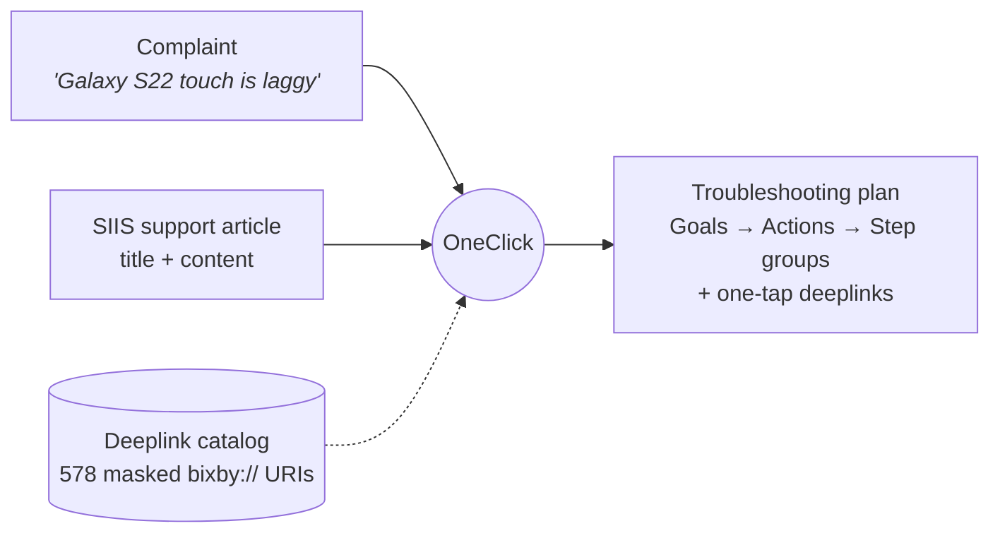
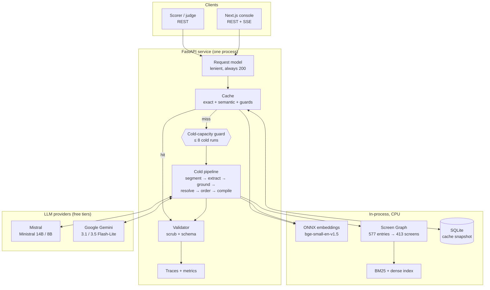
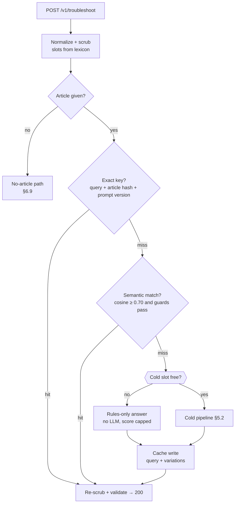
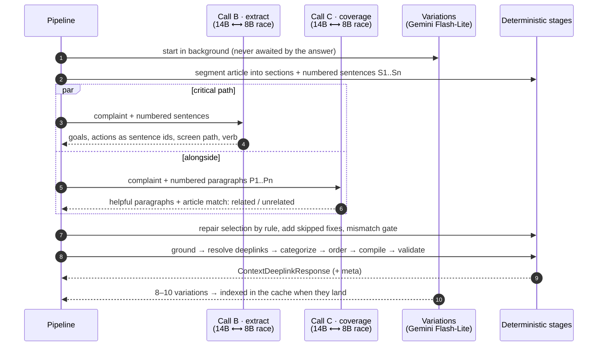
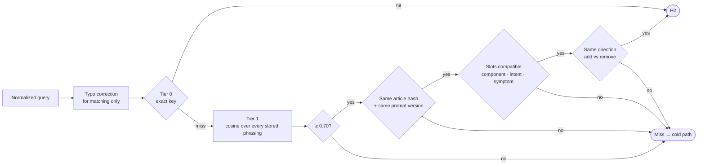
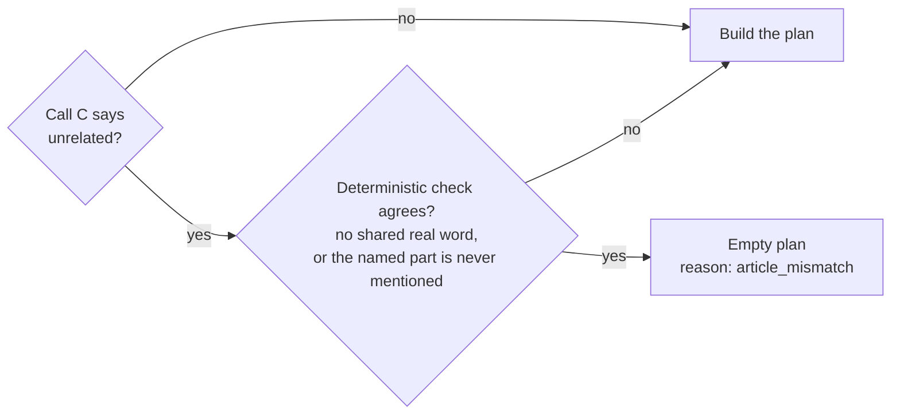
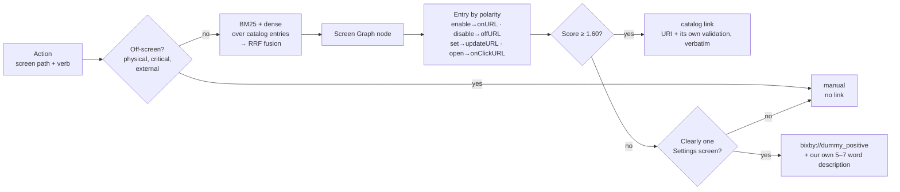
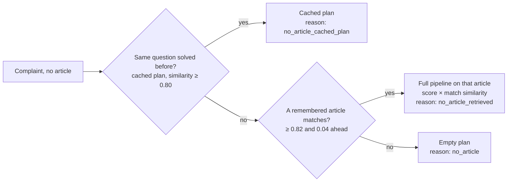
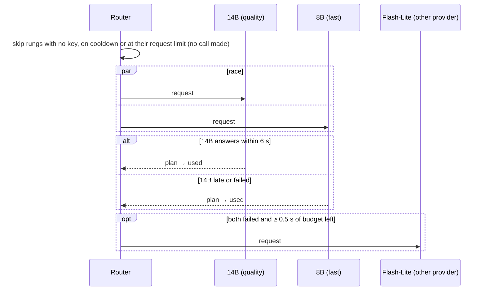
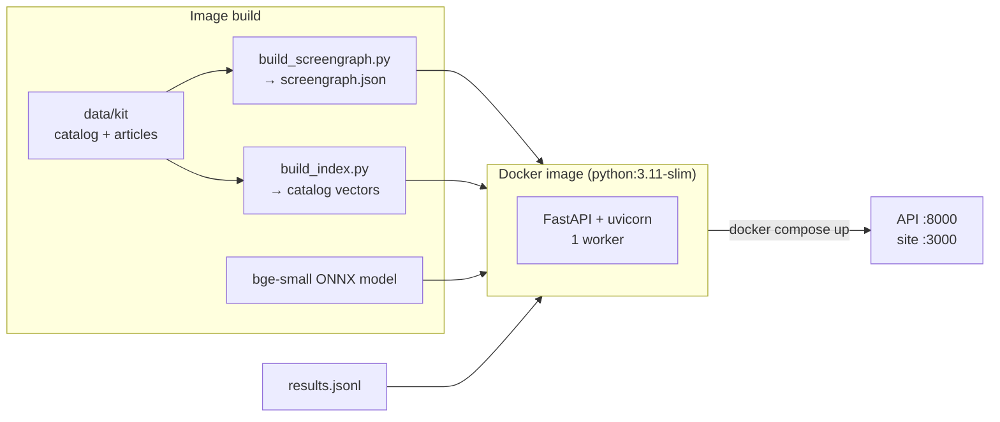

# OneClick — Architecture

> **Smart Guided Troubleshooting Engine** · Samsung PRISM GenAI Hackathon 2026, Theme 2
>
> A vague customer complaint and a support article go in. A grounded, schema-valid troubleshooting plan
> with verified Galaxy Settings deeplinks comes out, in about 5 seconds cold and a few tens of
> milliseconds from cache.

This document explains how the engine works and why it is built this way. Measured results live in
[metrics.md](metrics.md) and the model bake-off in
[eval/results/bakeoff/SUMMARY.md](../eval/results/bakeoff/SUMMARY.md). Every threshold named below is a setting in [`api/app/config.py`](../api/app/config.py).

---

## Contents

1. [At a glance](#1-at-a-glance)
2. [The problem](#2-the-problem)
3. [Design principles](#3-design-principles)
4. [System overview](#4-system-overview)
5. [Life of a request](#5-life-of-a-request)
6. [Components](#6-components)
7. [The LLM layer](#7-the-llm-layer)
8. [API contract](#8-api-contract)
9. [Reliability: degrade, never fail](#9-reliability-degrade-never-fail)
10. [Build, run and deploy](#10-build-run-and-deploy)
11. [Evaluation and observability](#11-evaluation-and-observability)
12. [Key decisions](#12-key-decisions)
13. [Limitations and roadmap](#13-limitations-and-roadmap)
14. [Repository map](#14-repository-map)

---

## 1. At a glance

| | |
| --- | --- |
| **Service** | One FastAPI app: `POST /v1/troubleshoot` (scored), `POST /v1/troubleshoot/stream` (live stages), `GET /health` |
| **Core idea** | The LLM *chooses*; deterministic code *writes*. Models pick article sentences; code builds every graded string |
| **Hallucination guard** | Steps are the article's own sentences, selected by id from a schema enum, then verified by a grounding check |
| **Deeplinks** | Retrieved from the 577-entry catalog through a Screen Graph (413 screens), never generated |
| **Cache** | Exact key + semantic match over each solved plan's query and 8–10 variations, guarded by slots, direction, article hash and prompt version |
| **Models** | Free tiers only. Mistral's open-weight Ministral 14B and 8B write the answer; Gemini 3.1 Flash-Lite writes query variations; Gemini 3.5 Flash-Lite is a cross-provider backup |
| **Runs on** | CPU only. Local ONNX embeddings (`bge-small-en-v1.5`), one Docker image, no external database |
| **Contract** | Always HTTP 200 with a body that validates against the organisers' `schema.py`, whatever fails inside |

---

## 2. The problem

Customers describe problems loosely ("my screen went black and won't transfer data"). A support agent
today reads a knowledge-base article, picks the relevant fixes, orders them and tells the customer where
to tap. The engine automates that:



### What must always hold

These are enforced in code and checked on every response, cache hits included.

| Invariant | How it is guaranteed |
| --- | --- |
| **Schema-valid** output (`ContextDeeplinkResponse`) | Final validation against the official `schema.py`; one repair pass; offending actions dropped |
| **No invented steps** | Steps are article sentences chosen by id; a grounding check drops anything that does not trace back |
| **Zero URLs** in any text | Input scrub before any LLM call, output scrub on every string; only catalog `bixby://` URIs survive, and only in link fields |
| **Verbatim deeplinks** | URIs and validation objects are copied from the matched catalog entry, never edited |
| **Always HTTP 200** | Every stage has a fallback; malformed requests get an empty, valid answer that says why |

### Targets

| Measure | Official target |
| --- | --- |
| Schema-valid responses | ≥ 90% (gate G4) |
| URL leaks | 0 (gate G5) |
| Repeat query, cache hit | p95 ≤ 300 ms at ≥ 90% hits |
| Unseen paraphrase, cache hit | ≥ 80% hit rate |
| Cold query, full pipeline | p95 ≤ 8 s |
| Unseen scenarios | valid and non-empty |
| Query variations | 8–10, lexically diverse |

Current measurements against each target are in [metrics.md](metrics.md).

---

## 3. Design principles

1. **LLM chooses, code writes.** The model never writes a string the scorer grades. It selects sentence
   ids and names; titles, goals, descriptions, categories, scores and links are built by rule.
2. **Every step is traceable.** A step is an article sentence, cited by id and verified. An empty answer
   beats a fabricated one.
3. **Retrieval, not generation, for deeplinks.** URIs come only from the catalog, through a reusable
   Screen Graph.
4. **The hot path never calls an LLM.** A cache hit is embeddings, arithmetic and guards: tens of
   milliseconds.
5. **Determinism comes from code.** Identical inputs get identical plans from the cache and the compiler,
   not from model temperature.
6. **Measure, then decide.** Every threshold and model choice was set by a measured run, and the
   evidence is kept (bake-off, gold set, ablation).

---

## 4. System overview



The scorer and the console reach the same engine. The streaming endpoint runs the identical pipeline
generator, so the scored answer and the live stream can never disagree.

---

## 5. Life of a request

### 5.1 Hot path and cold path



A hit costs one embedding and one matrix product; no LLM is involved. A miss runs the cold pipeline,
then stores the plan under the original query and, once they arrive, its 8–10 variations, so later
paraphrases hit.

### 5.2 The cold pipeline

Three LLM calls run **in parallel**; only call B is on the answer's critical path.



| # | Stage | Module | What it does | LLM |
| --- | --- | --- | --- | --- |
| 1 | Normalize | `pipeline/normalize.py`, `deglue.py`, `slots.py` | Fix numbering and whitespace, scrub URLs and emails from query and article, restore spaces in glued articles, read slots | – |
| 2 | Cache | `cache/` | Exact and semantic lookup, typo-tolerant, guarded | – |
| 3 | Segment | `pipeline/segment.py` | Sections and numbered sentences; section relevance per intent | – |
| 4 | Extract | `pipeline/extract.py` | Call B selects sentence ids per action; rule-based repairs | **B** |
| 5 | Coverage | `pipeline/extract.py` | Call C marks helpful paragraphs and article fit; skipped fixes added | **C** |
| 6 | Mismatch gate | `pipeline/mismatch.py` | Turn away an article unrelated to the complaint | – |
| 7 | Ground | `pipeline/ground.py` | Keep only steps that trace back to their cited sentences | – |
| 8 | Resolve | `screengraph/resolver.py`, `retrieval/` | Screen path + verb → catalog deeplink, placeholder, or none | – |
| 9 | Categorize, order, multi-intent | `pipeline/categorize.py`, `order.py`, `multi_intent.py` | auto / manual / critical; least disruptive first; one goal per problem | – |
| 10 | Compile + validate | `compiler/` | Build every graded string by rule; scrub; schema-validate | – |

---

## 6. Components

### 6.1 Input normalization

Runs first, with no LLM.

- **Query.** Kit numbering (`1. "…" 2. "…"`) and quotes removed, whitespace collapsed; a lower-cased copy
  is the cache key. Queries are capped at `query_max_chars` (2,000).
- **Scrub.** URLs, emails, domains and markdown links are removed from the query *and* the article
  before any LLM sees them. The scrub canonicalizes first (HTML entities, NFKC, invisible characters)
  and every pattern is length-bounded, so hostile input stays linear.
- **Glued articles.** Some kit articles arrive with words run together (`restartyourdeviceandensure…`).
  `deglue.py` restores the spaces using a word-frequency list, only in articles with several unknown runs,
  and only ever adds spaces.
- **Slots.** Component (screen, battery, camera…), symptom (black, flicker, drain…) and intent (fault
  vs configure) are read from [`data/slot_lexicon.json`](../data/slot_lexicon.json) by phrase match, never
  from a model:
  - the earliest mention wins, because a complaint names its subject first ("my screen went black … cannot
    use Smart Switch" is a screen problem);
  - an app is a weak component: it wins only when no real part is named;
  - denied phrases are ignored ("there is no physical damage" is not `cracked`), and a longer phrase beats
    a shorter one ("touch screen" over "screen");
  - intent is `configure` when the complaint asks for a behaviour ("I want", "is there a way to", "how do I
    set…") and `fault` otherwise, so "how do I fix my black screen" stays a fault.

### 6.2 Cache



- **Two tiers.** Tier 0 is a hash of prompt version + normalized query + article hash. Tier 1 is a
  brute-force cosine search over every stored phrasing: each solved plan is indexed under its original
  query and its 8–10 variations.
- **Guards.** Similarity alone serves the wrong plan to near-miss complaints ("screen is black" vs "screen
  is cracked"), so a hit also needs a matching article, a plan made by the current prompts, compatible
  slots, and the same direction for configure requests ("add a floating button" is never served
  "remove it").
- **How the slot guard decides** (incoming query first, cached entry second):
  - *component*: two filled values that differ block the hit (battery is not screen);
  - *intent*: `fault` and `configure` never match, so "I want my screen to go black" is not served the
    black-screen fault plan;
  - *symptom, one-sided*: a query that names a symptom misses an entry that names none. The reverse is a
    wildcard, because terse paraphrases often name no symptom; making it strict dropped paraphrase hits
    from 82% to 54%.

  Embeddings alone rate "screen is black" and "screen is cracked" 0.91 alike; the guard is what keeps
  them apart.
- **Why the threshold is 0.70.** Chosen from a 0.55–0.85 sweep on the real cache (the 20 kit plans and
  their generated variations) against 200 held-out paraphrases and 60 near misses:

  | Threshold | Paraphrase hits (target ≥ 80%) | Served a sibling row's plan | Near-miss false hits |
  | --- | --- | --- | --- |
  | **0.70** | **84%** | 2 | 1 / 60 |
  | 0.75 | 82% | 2 | 1 / 60 |
  | 0.80 | 79% | 1 | 1 / 60 |
  | 0.85 | 73% | 0 | 1 / 60 |

  With the guards in place, false hits no longer move with the threshold, so the threshold only trades
  paraphrase hits. The two sibling-plan hits are rows that share an article and the same fault; neither
  mixes up two problems. The one near-miss hit ("I want to *add* a floating circle" against "I want to
  *remove* it") is what the direction guard now blocks.
- **Rewordings that change the problem are dropped.** A generated variation whose slots contradict the
  query's could never serve its own plan past the guard (33 of 200 did); such variations are used only to
  fill the list up to 8.
- **Typo tolerance.** Before matching, misspelt words are corrected (`pipeline/spell.py`) on both the
  stored and the incoming side: "screne stays blnak" matches as a blank-screen complaint. Only matching
  uses the corrected text; the LLM and every step see the customer's own words. Measured in-process:
  typo paraphrases 65% → 92.5% hits, near-miss false hits 1 → 0 of 60.
- **Storage.** In memory, snapshotted to SQLite. The article cache **ships empty**, so a judge's first
  call on each query is genuinely cold. Identical concurrent misses are serialized (single flight).
- Every hit is re-scrubbed and re-validated before it is sent.

### 6.3 Extraction (call B, select mode)

The model does not write steps. It receives the article as numbered sentences grouped by section and
returns, per problem in the complaint:

- a problem statement, a 2–3 word title and a topic;
- up to 8 actions, each a list of **sentence ids**, a name, a draft description, the Settings path down
  to the setting itself, and a verb (enable, disable, set, open, check, restart, reset, visit).

The JSON schema makes `ids` an **enum of the article's own sentence ids**, so an invented id cannot even
be decoded. The steps are then the article's sentences, split into single instructions, with filler
("you can", "please") removed and nothing added.

The selection is repaired **by rule, never by adding words**:

| Rule | Example |
| --- | --- |
| An introducing line brings its instructions | "To perform a factory data reset:" pulls the steps below it |
| A procedure joined at its end gets its start | a chosen "Tap Restart again" gets "Press and hold the Power button" |
| An action that stops short of its setting is extended | a Clear-cache path gets the step that reaches Storage |
| Every listed method is kept | "There are two methods for this:" keeps both |
| A second procedure is split off | "To exit Safe mode, …" becomes its own action |
| Repeated selections merge | two actions citing the same sentences become one |

An empty answer ("this article does not address the complaint") is trusted only when at least two
models agree and one of them is 14B (`extract_empty_votes`, `extract_empty_needs_primary`); otherwise the
rules extractor stands in.

### 6.4 Coverage (call C) and the mismatch gate

Models skip fixes. Call C runs next to call B on the article's instruction **paragraphs** and returns
the ones that help with the complaint, each with a short name. Paragraphs call B skipped become actions
built from the article's own sentences; in a numbered procedure the general fixes (damage check,
charging, restart, Safe mode, update, reset, support) are added too, up to 12 actions per goal.

Call C also labels the article `related` or `unrelated`. Loosely paired articles are common in the kit,
so the label alone is not trusted:



- **Word path.** None of the complaint's distinctive words (ignoring stopwords, UI verbs, generic words
  and general-fix vocabulary) appears anywhere in the article. A misspelt complaint gets no verdict.
- **Component path.** A fault complaint names a part (camera, battery…) that the article never mentions
  by any of its lexicon phrases.
- With no model verdict (no key, or the capacity limit), only the component path may act.

Measured: together the two signals act on 0 of 17 kit complaints, 0 of 15 unseen scenarios, 0 of 59 near
misses and 0 of 168 matched paraphrases, and they do catch a complaint paired with an unrelated article.
The deterministic half alone fires on 57% of 615 cross-domain pairs and 0 of 295 matched pairs
(`eval/tools/measure_mismatch.py`).

### 6.5 Grounding

A step survives only if it is a word-for-word run of a cited sentence, **or** it clears an embedding
similarity of 0.75 against the cited sentences **and** shares a content term with them. Failing steps
are dropped; actions left empty are dropped. If nothing survives, the answer is empty with
`fallback: no_match`, never a guess.

### 6.6 Deeplink resolution



- **Screen Graph.** Offline, the catalog is cleaned (boilerplate stripped, polarity read from
  `originalType` or `message`) and entries that share a validation key collapse into one screen node:
  577 entries become 413 screens. A step maps to a screen first, then the step's verb picks the right
  entry, which avoids parent-menu matches and wrong-polarity toggles.
- **How a link is scored.**
  1. BM25 over the cleaned catalog (`message` and `qna_description` weighted 2×) and dense embeddings over
     the same entries.
  2. Reciprocal rank fusion (k = 60) merges the two by rank, since a BM25 score and a cosine are not
     comparable.
  3. Adjustments on the fused score: a leaf-name match up to +0.60 (two-way, so "Storage" does not score
     full marks against "Storage Share"); +0.25 when the entry's type matches the verb and −0.35 for the
     opposite toggle; −0.30 for TV and Samsung Members entries.
  4. A score of at least 1.60 (of a possible 1.85) is trusted as a catalog link.

  What each part is worth, on the 87 gold steps that have a catalog answer:

  | Configuration | Precision@1 | Time per step |
  | --- | --- | --- |
  | As shipped | **91%** | ~5 ms |
  | Without the polarity adjustment | 84% | |
  | Searching screens instead of entries | 86% | |
  | With a cross-encoder rerank | 87% | ~150 ms |

  The **cross-encoder rerank is implemented but off** (`use_rerank = False`): catalog entries are terse
  fragments ("power saving mode"), not what the reranker was trained on, and it costs 30× the time for
  lower precision. The Screen Graph is therefore used to pick the right toggle within a screen, not as
  the search index.
- **Page fallback.** A change verb with no matching toggle can take the screen's own page link, but only
  when that page clears the same floor and its name matches a segment of the step's path ("Select Buttons
  to turn off full screen gestures" opens the Navigation bar page; "Volume > Alarm" no longer opens Do Not
  Disturb's alarms). It raised precision@1 on the gold set from 88% to 91%.
- **Catalog gaps are correct answers.** Software update, Safe mode, Dark mode, auto-rotate and factory
  data reset have no catalog entry, so those steps get the placeholder or no link.
- Measured on 123 hand-labelled steps: precision@1 **90.8%**, relevance 1.84 / 2. Plain hybrid retrieval
  scored 60.9% and full LLM mapping 73.6% on the same set (see the ablation in [metrics.md](metrics.md)).
- **How much to trust these numbers.** 87 of the 123 gold steps were labelled by the person who tuned the
  resolver, so they flatter it. On the 36 steps labelled independently, which include deliberate
  look-alikes ("Wi-Fi" vs "Wi-Fi scanning"), 20 of 24 catalog steps get the right link and 4 of 36 get a
  wrong one; on the tuner's own 87 it is 57 of 63 and 1 of 87. The independent half is the honest figure.

### 6.7 Categorize, order, multi-intent

**Category** is set by rule: restart, Safe mode, software update and factory reset are `critical`;
physical and external steps are `manual`; `auto` only when a link resolved.

**Order** is least disruptive first:

| Rank | Kind | Examples |
| --- | --- | --- |
| 0 | Quick checks, settings screens | Inspect for damage, toggle a setting |
| 1 | App-level fixes | Clear cache, update or reinstall an app |
| 2 | Connectivity and accounts | Reset network settings, sign in again |
| 3 | Diagnostics | Samsung Members diagnostics |
| 4 | External help | Contact support, visit a service centre |
| 5 | Critical, in this order | Restart < Safe mode < software update < factory reset |

A prerequisite table ([`data/dependencies.json`](../data/dependencies.json)) then applies: backup before
factory reset, charging before a force restart, Safe mode before what must be done in it. Entering Safe
mode, the steps done in it and leaving it are kept together. Article order breaks ties.

**Multi-intent.** A complaint with several problems becomes one goal per problem. An action that fits
several goals is kept only in the goal where it is most relevant; goals the model invented that the
complaint never states are folded into the one it does.

### 6.8 Compiler and validation

Every graded string is built by rule:

| Field | Rule |
| --- | --- |
| `goal` | `Follow these steps to perform this {Topic} Troubleshooting.` (or `Configuration.`) |
| `title` | Model-proposed, trimmed to 2–3 words, sentence case |
| `actionName` | Title Case, deduplicated; actions on the same screen merged |
| `description` | "It will" + 5–7 words in total |
| `steps` | Imperative, trailing period, no numbering |
| `category` | By rule, §6.7 |
| `score` | `0.4 × section relevance + 0.3 × grounding coverage + 0.3 × link coverage`, clamped 0–1 |

Link coverage counts only actions that should have a link (catalog 1.0, placeholder 0.5, manual
excluded), so a correct, mostly physical plan is not penalized. The validator then scrubs every string,
validates against the official schema, runs one repair pass and drops whatever still fails.

### 6.9 Requests without an article

Missing, `null`, empty and title-only articles are one case. The LLM never fills the gap:



All three carry `fallback: no_siis_context`. The kit's 20 plans (from `results.jsonl`) and 11 articles are
pre-loaded at startup.

### 6.10 Cold-capacity guard

The API is public and unauthenticated, and a cold run holds a worker thread and LLM quota for seconds.
At most 8 cold pipelines run at once (`cold_max_concurrent`). A request that finds no free slot within
0.25 s gets the rules-only answer straight away instead of queueing: no LLM call, score capped at 0.5,
cached for 10 minutes. Cache hits therefore never wait behind cold load, and a burst cannot exhaust the
free tier. The limit is global rather than per client, because a scorer sends everything from one
address. The sync endpoints get 100 worker threads, more than the cold limit.

---

## 7. The LLM layer

### 7.1 Model ladders

Every call goes through one router ([`llm/router.py`](../api/app/llm/router.py)). Each stage walks an
ordered **ladder** of models; the first two usable rungs race where noted.

| Call | Role | Ladder | Mode |
| --- | --- | --- | --- |
| **B** extract | Writes the plan (critical path) | `ministral-14b-latest` ⟷ `ministral-8b-latest`, then `gemini-3.5-flash-lite` | Race; 14B kept if back within 6 s; stage budget 6.3 s |
| **C** coverage | Adds skipped fixes, judges article fit | `ministral-14b-latest` ⟷ `ministral-8b-latest` | Race; 14B kept if back within 4 s; waited ≤ 4.5 s |
| Variations | 8–10 paraphrases for the cache and `results.jsonl` | `gemini-3.1-flash-lite`, then `ministral-8b-latest` | Background; never delays an answer |



- **Why this order.** 14B scored best in every run (kit 2.60 against Flash-Lite's 2.40, about 8B's
  level). 8B races it because 14B is sometimes late, and a Mistral model is available in the evening
  hours when Gemini's free tier was measured failing on every model. Flash-Lite is third so a Mistral
  limit or outage still leaves a model from another provider.
- **Quota awareness.** Mistral's free plan limits requests per model per minute (14B 30, 8B 188).
  [`llm/quota.py`](../api/app/llm/quota.py) counts each model's requests, reads the provider's
  rate-limit headers, and skips a rung at its limit instead of drawing a 429. Call C stops using 14B
  once 14B has made 10 requests in the minute, leaving the rest to call B. A model answering 429 or 5xx is cooled down for 20 s.
- **Configuration.** Each ladder can be overridden from the environment (`ONECLICK_EXTRACT_MODELS`,
  `ONECLICK_COVERAGE_MODELS`, `ONECLICK_VARIATIONS_MODELS`), so a model bake-off needs no code change.
- **Clients.** Mistral uses an OpenAI-compatible client with a strict JSON schema
  ([`llm/openai_compat.py`](../api/app/llm/openai_compat.py)); Gemini has its own client
  ([`llm/gemini.py`](../api/app/llm/gemini.py)). Mistral runs at temperature 0, Gemini at 1.0 (Google's
  guidance for Gemini 3); repeatability comes from the cache and the compiler.
- **Prompts** are versioned files in [`llm/prompts/`](../api/app/llm/prompts/) (`extract.v3`,
  `coverage.v2`, `variations.v1`). The prompt version is part of the cache key.

### 7.2 How the models were chosen

A four-stage bake-off on the kit and the unseen set, judged three times per candidate
([SUMMARY.md](../eval/results/bakeoff/SUMMARY.md)):

| Candidate | Outcome |
| --- | --- |
| Groq `gpt-oss-120b` | Tied 14B on step accuracy (2.53 vs 2.53); capped at 8K tokens a minute; false "no match" on hard articles |
| Groq `gpt-oss-20b`, Qwen 3.8 27B | False "no match" on 2–3 of 6 hard articles |
| NVIDIA free API | Timeouts of 30–40 s, 404s and 503s on both test days |
| Gemini 3.5 Flash-Lite for call B | Kit 2.40 vs 14B's 2.60; kept as the third rung |
| Gemini 3.1 Flash-Lite for variations | Half 8B's word overlap between variations, no wrong plan served: **adopted** |

Two settings bugs found on the way mattered more than any swap: the old last-resort model was served 0
requests a minute on the free plan, and Mistral rejected a `reasoning_effort` field on every call,
halving 14B's capacity. Both were removed.

### 7.3 Without keys

With no key, or every provider down, the pipeline runs **rules-only**: the article's own instruction
sentences from its most relevant sections. Answers stay grounded and schema-valid, with the score capped
at 0.5 and `meta.reason = rules_only`. An article about something else entirely still gets an empty plan
rather than borrowed steps.

---

## 8. API contract

| Method | Path | Purpose |
| --- | --- | --- |
| `POST` | `/v1/troubleshoot` | Complaint + article → plan. The scored endpoint |
| `POST` | `/v1/troubleshoot/stream` | Same engine, one Server-Sent Event per stage |
| `GET` | `/health` | `{"status":"ok"}` once the catalog, Screen Graph, indexes and cache are loaded; 503 before |
| `GET` | `/v1/metrics`, `/v1/traces`, `/v1/trace/{id}` | Rolling latency and cache counters; recent traces |

No authentication; CORS open.

**Request.** `siis_response` accepts the kit's `{title, content}` object or a plain string. The request
model is deliberately lenient: a missing query, a number or a list of articles is read as best it can
be, and a body that is not JSON at all still gets a 200 with an empty plan.

```json
{
  "query": "My Galaxy S22 screen inputs are delayed and the touch responsiveness is laggy",
  "siis_response": { "title": "Touchscreen is slow or unresponsive", "content": "…" }
}
```

**Response.** The official `ContextDeeplinkResponse`, plus a `meta` block that Pydantic ignores when
validating. The same values are also sent as `X-Latency-Ms`, `X-Cache-Hit`, `X-Cache-Tier` and
`X-Cost-Usd` headers.

```json
{
  "contexts": [
    {
      "goal": "Follow these steps to perform this Touchscreen Responsiveness Troubleshooting.",
      "title": "Touchscreen lag issues",
      "score": 0.86,
      "actions": [
        {
          "actionName": "Enable Touch Sensitivity",
          "description": "It will enhance touch responsiveness",
          "category": "auto",
          "stepGroups": [
            {
              "steps": [
                "If you wish to keep your screen protector on, try enabling the \"Touch sensitivity\" option.",
                "Go to Settings.",
                "Tap Display.",
                "Tap the switch next to Touch sensitivity."
              ],
              "actionableDeeplink": {
                "deeplink": "bixby://masked/act/14eb42b895",
                "description": "Enables touch sensitivity via device Settings on the device.",
                "message": "Enable Touch sensitivity",
                "originalType": "onURL"
              },
              "validationDeeplink": {
                "deeplink": "bixby://masked/val/6451858b28",
                "key": "Touch sensitivity",
                "resultType": "boolean",
                "condition": "equal",
                "value": "True"
              }
            }
          ]
        }
      ]
    }
  ],
  "meta": {
    "latency_ms": 5150.9, "cache_hit": false, "cache_tier": null, "model": "ministral-14b-latest",
    "cost_usd": 0.0, "trace_id": "t_995929d4d8", "fallback": null, "source": null,
    "reason": null, "message": null
  }
}
```

One action shown; the real plan for this complaint has twelve. The deeplink and its validation object
are copied unchanged from the catalog entry (`DL-0126`).

**Why an answer is empty or unusual.** The schema has only `contexts`, so `meta.reason` and
`meta.message` explain, by rule and link-free:

| `meta.reason` | `fallback` | Meaning |
| --- | --- | --- |
| `no_article` | `no_siis_context` | No article, nothing similar solved or remembered |
| `no_article_cached_plan` | `no_siis_context` | No article; plan from a previously solved question |
| `no_article_retrieved` | `no_siis_context` | No article; plan built from a remembered matching article |
| `article_mismatch` | `no_match` | The article is about something else (§6.4) |
| `no_grounded_fix` | `no_match` | The article has no steps for this complaint |
| `unreadable_query` | `no_match` | The complaint holds no readable word |
| `invalid_request` | `no_match` | The body could not be read |
| `rules_only` | – | Answered without a model (no key, or the capacity limit) |

**Stream.** Events in order `cache → enrich → segment → extract → ground → resolve → compile → done`,
each `{stage, ms, summary, detail}`; `done` carries the full response. A cache hit goes from `cache`
straight to `done`.

---

## 9. Reliability: degrade, never fail

| Failure | What happens |
| --- | --- |
| 14B slow or failing | 8B's racing answer is used |
| All of Mistral limited or down | Rungs skipped or fail fast; Gemini Flash-Lite answers |
| Every model fails, or no key | Rules-only answer, score capped at 0.5, cached for 10 minutes then retried |
| Call C late or failing | Numbered-procedure completion stands in; no article-fit verdict, so nothing is turned away by the model |
| Variations call fails | Template variations fill up to 8–10 |
| Too many cold requests at once | Rules-only answer immediately; cache hits unaffected |
| Nothing survives grounding | Empty plan, `no_match`, `no_grounded_fix` |
| Compiled plan fails validation | One repair pass, then the offending action is dropped |
| Malformed request | 200 with an empty plan and `invalid_request` |
| Any unexpected exception | 200 with an empty, valid plan |

---

## 10. Build, run and deploy



- **One image** holds the embedding model, the Screen Graph, the indexes and `results.jsonl` (for the
  no-article path). Nothing is downloaded at runtime except LLM calls.
- **Readiness.** `/health` returns 503 until everything is loaded, then `{"status":"ok"}`. Startup also
  pre-warms the no-article path (about 2 s).
- **One worker** on purpose: the cache lives in process memory, and a second worker would miss the first
  one's hits.
- **Keys** come only from environment variables (`MISTRAL_API_KEY`, `GEMINI_API_KEY`); `.env` is never
  committed. Both are optional (§7.3).
- **Console.** A statically prerendered Next.js site. Its walkthrough replays real recorded engine runs;
  its Live section streams `/v1/troubleshoot/stream` from the running API and shows `meta.message` for
  empty answers.

---

## 11. Evaluation and observability

We built our own copy of the organisers' scorer first, so every change is measured before it merges.

| Tool | Measures |
| --- | --- |
| `eval/gate_replica.py` | Gates G2–G5 and blocks A1–A5, each query twice on an empty cache, plus an adversarial set (typos, Hinglish, URL payloads, malformed input) |
| `eval/judge.py` | Step accuracy 0–3 and deeplink relevance 0–2 by an LLM judge, per plan, against the plan's own article; flags plans written by the judge's own model family |
| `eval/loadtest.py` | Latency p50/p95 for repeat, paraphrase and cold paths (N ≥ 30), paraphrase hit rate, near-miss false hits |
| `eval/ablation.py` | Deeplink mapping variants on the gold set |
| `eval/tools/measure_mismatch.py` | The mismatch gate's deterministic half, without an LLM |
| `eval/report.py` | Regenerates [metrics.md](metrics.md) in the organisers' Appendix C format |

**Test sets** (`eval/sets/`): 200 held-out paraphrases (never used to warm the cache), 60 near misses,
15 unseen scenarios across Battery, Camera and Performance, an adversarial set, and 123 hand-labelled
step → deeplink pairs (`data/gold/`).

**CI** (GitHub Actions) runs the API tests, lint, the eval tests, the set validator and the gate replica
on every pull request and push to `main`.

**Observability.** One structured JSON log line per request (trace id, stage timings, cache tier, model,
tokens, cost, degradations). `/v1/metrics` serves a rolling window of the last 1,000 requests;
`/v1/trace/{id}` the full trace of a recent request.

---

## 12. Key decisions

| Decision | Alternatives considered | Why |
| --- | --- | --- |
| **LLM selects sentence ids; code writes the output** | LLM rewrites steps and fields | No invented step can be decoded; ~5× fewer output tokens; graded formats hold by construction |
| **Retrieval + Screen Graph for deeplinks** | LLM mapping; keyword rules | 90.8% precision@1 vs 73.6% (LLM) and 75.9% (rules); exact URIs guaranteed; reusable across scenarios |
| **Semantic cache over query + variations, with guards** | Exact keys; canonical LLM-rewritten keys | Paraphrases hit with no LLM on the hot path; guards keep near-miss false hits ≤ 2% |
| **Local ONNX embeddings, in-memory index** | Embedding API; vector database | Tens of milliseconds, no network, no extra service |
| **Free-tier models chosen by bake-off** | Paid frontier models | Reproducible by anyone with free keys; the measured winner (Ministral 14B) was not beaten by larger free models |
| **Two-signal mismatch gate** | Embedding relevance threshold; model verdict alone | Relevance cannot separate unrelated from loosely paired articles; the model alone flags good pairs; together they act only on true mismatches in every measured set |
| **Rules-only degrade and capacity guard** | Queueing; failing | Always a grounded, valid answer; hits never wait behind cold load |
| **One process, one worker** | Multiple workers, shared cache service | The in-memory cache must see every request; enough for a judge's load |

---

## 13. Limitations and roadmap

**Known limitations**

- **Loosely paired articles.** When an article is about a different problem than the complaint, the plan
  can only offer that article's nearest fixes. Steps stay correct to the article but may not solve the
  complaint.
- **Catalog gaps.** Several common screens have no catalog entry, so those steps get the placeholder
  deeplink or none.
- **Free-tier variance.** Which model answers depends on provider load at that moment; the cache then
  serves the first answer identically.
- **Cache scale.** The semantic index is a brute-force matrix grown on every insert, and per-key locks are
  never pruned. Fine for thousands of plans, not for millions.
- **Device simulator.** Designed (apply an action, validate it against a simulated device) but not part of
  this submission.

**At 10k+ scenarios**

| Area | Today | At scale |
| --- | --- | --- |
| Deeplink mapping | Per-request retrieval | Screen Graph lookup; retrieval only for new screens |
| Plans | Built on first request | Batch-compiled offline, reviewed, versioned |
| Cache | In process + SQLite | Redis with an HNSW or managed vector index |
| Serving | One container | Stateless replicas behind a load balancer |
| Quality | Eval harness | Review queue for low-score plans, drift monitoring |

---

## 14. Repository map

| Path | Contents |
| --- | --- |
| `api/app/pipeline/` | Orchestrator (`run.py`), normalize, slots, spell, segment, extract, mismatch, ground, categorize, order, multi-intent, capacity |
| `api/app/cache/` | Exact and semantic tiers, slot and direction guards, no-article path, SQLite store |
| `api/app/llm/` | Router, model ladders, quota tracking, Mistral and Gemini clients, versioned prompts |
| `api/app/screengraph/`, `api/app/retrieval/` | Catalog cleaning, Screen Graph, resolver; BM25, dense, fusion |
| `api/app/compiler/` | Templates, trimmer, scrub, reason messages, schema validation |
| `api/app/schema.py` | The organisers' official response schema, unmodified |
| `api/tests/` | API test suite |
| `console/` | Next.js site: recorded walkthrough and live section |
| `eval/` | Gate replica, judge, load test, ablation, test sets, report generator |
| `data/` | Kit files, slot lexicon, dependency table, gold labels, fixtures |
| `docs/` | This document, [metrics.md](metrics.md), submission deck, AI disclosure |
